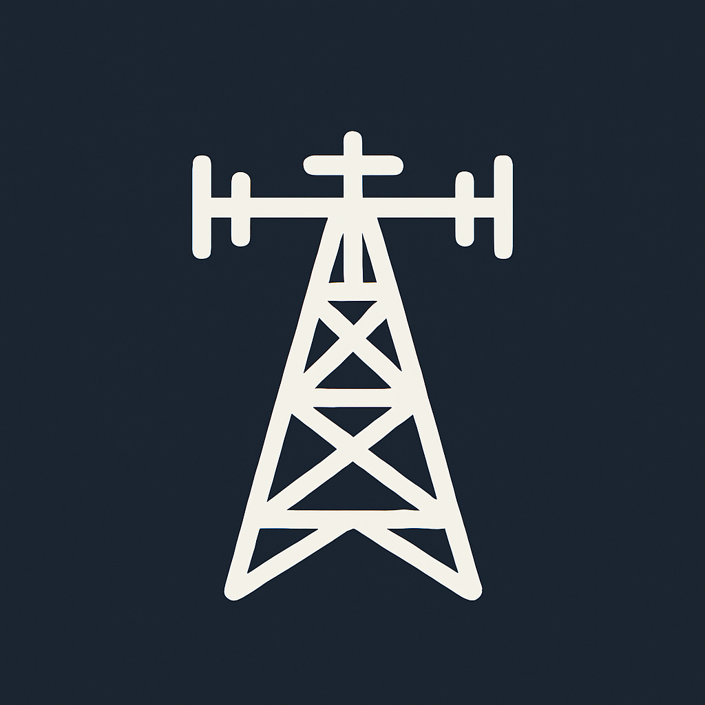

<div align="center">
  
</div>

# rundown — AI-Powered RSS Reader
[](https://github.com/howyi/rundown/actions/workflows/on-pr.yml)

rundown crawls your subscribed RSS feeds every 15 minutes, detects new or updated articles, and generates AI-powered summaries.
You can customize the summary language and length, and receive notifications via Discord Webhook.

[Live Demo](https://rundown.sbox.studio) | [GitHub](https://github.com/howyi/rundown) 

[](https://railway.com/deploy/rundown-1?referralCode=uKuNOt)

---

## Key Features

### RSS Feed Registration & Management

* Register and manage multiple RSS feeds in one place.
* Simple UI for adding, editing, and deleting feeds.


### Update Detection + AI Summarization

* Checks feeds every 15 minutes for new articles.
* Summarizes using **gpt-5-nano** with multi-language and adjustable length options.


### Timeline View

* Browse summarized articles in chronological order.
* Easily access past articles.


### Discord Webhook Notifications

* Get instant updates in your Discord channels.
* Ideal for teams and communities.


### MCP Integration

* Access feed and article data programmatically via the MCP server.
* Connect to `rundown.sbox.studio/mcp` using an API key generated from the settings page.
* MCP server is built with [Vercel’s mcp-handler](https://github.com/vercel/mcp-adapter).


---

## Tech Stack

**Frontend & Auth**

* Next.js
* better-auth (email/password authentication)

**Backend Processing**

* Railway Cronjob (crawl jobs)
* OpenAI gpt-5-nano (AI summarization)

**Database**

* PostgreSQL (feeds, articles, summaries, and user settings)

---

## Railway Setup

Services running on Railway:

* Next.js app
* Crawl Worker
* PostgreSQL
* Bootstrap (runs migrations and re-registers cron jobs after deploy)


---

## Local Development (pnpm / mise / Docker)

This repository uses **mise** for tool version management and **pnpm** as the package manager. The database is started with **Docker Compose**.

### Requirements

* Docker and Docker Compose
* mise installed (`mise --version` to verify)
* Node.js and pnpm managed by mise (`mise install` according to `.mise.toml`)

### Setup Steps

1. Clone the repository

   ```bash
   git clone https://github.com/howyi/rundown.git
   cd rundown
   ```

2. Install tools via mise

   ```bash
   mise install
   ```

3. Set environment variables
   Copy `.env.example` to `.env` and fill in `OPENAI_API_KEY` and `BETTER_AUTH_SECRET`.

   ```bash
   cp .env.example .env
   ```

4. Start application and DB concurrently

   ```bash
   pnpm dev
   ```

   * `pnpm dev` starts the DB via Docker Compose and launches the development server.

5. Initialize (migrations and job registration)

   ```bash
   pnpm bootstrap
   ```

   * Runs migrations and registers the feed crawling cron job.

> Note: Do not use the default `npm` command. Use `pnpm` instead.

---

## Deployment (Railway)

You can deploy directly from the [Railway Template](https://railway.com/deploy/rundown-1) by setting the required environment variables. 
See "Railway Setup" above for the service structure.
